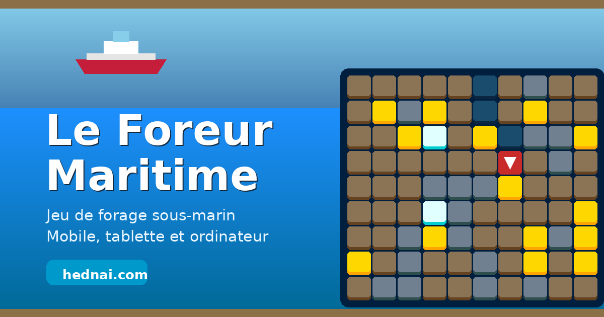

# ForeurMaritime# Le Foreur Maritime

Jeu de forage sous-marin gratuit, jouable directement dans le navigateur sur téléphone, tablette et ordinateur. Aucune installation requise, aucun compte, aucune publicité.

**Jouer : [foreur.hednai.com](https://foreur.hednai.com)**



---

## Le principe

Vous pilotez un foreur sous-marin qui ne peut que descendre ou se déplacer latéralement. Chaque mouvement consomme de l'oxygène. La partie se termine quand la réserve est vide.

Sous vos pieds, quatre matériaux :

| Tuile | Effet |
| --- | --- |
| Sédiment | Se creuse librement, coûte 50 points |
| Roche | Infranchissable, il faut un sonar pour la pulvériser |
| Or | 100 points et un peu d'oxygène |
| Diamant | 1 000 points et une belle recharge d'oxygène |

Tout l'intérêt est là : descendre vite épuise l'oxygène sans rien rapporter, mais chercher le butin fait dépenser des mouvements. L'or et les diamants sont donc à la fois le score et le carburant.

La profondeur est illimitée. Le terrain se durcit à mesure que vous descendez, à travers quatre paliers inspirés de la bathymétrie réelle : plateau continental, talus, plaine abyssale, fosse. Plus bas, plus de roche, mais aussi plus de diamants.

Le sonar pulvérise les quatre cases adjacentes. Vous démarrez avec une charge et en regagnez une tous les 15 mètres de profondeur inédite, jusqu'à trois en réserve.

## Les commandes

| Action | Téléphone et tablette | Ordinateur |
| --- | --- | --- |
| Aller à l'ouest | Balayage vers la gauche, ou bouton | Flèche gauche |
| Aller à l'est | Balayage vers la droite, ou bouton | Flèche droite |
| Creuser vers le bas | Balayage vers le bas, ou bouton central | Flèche bas |
| Sonar | Bouton sonar | Barre d'espace |
| Aller sur une case voisine | Toucher la case | Clic sur la case |

## Ce que le jeu propose

- **Profondeur illimitée** avec défilement automatique du plateau et difficulté progressive.
- **Interface adaptative** : 9 colonnes sur téléphone, 12 sur tablette, 15 sur ordinateur. La taille des tuiles est recalculée à partir de la place réellement disponible, en portrait comme en paysage.
- **Thème clair et thème sombre**, mémorisés, avec détection du réglage du système.
- **Bilingue français et anglais**, mémorisé également.
- **Installable** comme application grâce au manifeste et au service worker, et **jouable hors ligne** une fois la première visite effectuée.
- **Meilleur score conservé** localement sur l'appareil.
- Sons désactivables, et respect du réglage système de réduction des animations.

## Stack technique

JavaScript standard, sans aucune dépendance ni étape de compilation. Le dépôt se déploie tel quel sur n'importe quel hébergeur statique.

- Modules ES natifs
- CSS avec variables personnalisées pour les deux thèmes
- API Web : `localStorage`, `ResizeObserver`, `Pointer Events`, `Service Worker`, `Web App Manifest`
- Polices Outfit et JetBrains Mono

### Organisation du code

Chaque module a une responsabilité unique et la logique de jeu ne touche jamais au DOM : elle émet des événements que l'interface écoute.

```
index.html              structure et métadonnées
css/style.css           thèmes, mise en page, tuiles
js/config.js            toutes les constantes réglables
js/i18n.js              dictionnaire français et anglais
js/preferences.js       persistance localStorage
js/audio.js             sons et déverrouillage iOS
js/grille.js            modèle du plateau, génération infinie
js/rendu.js             dimensionnement et rendu incrémental
js/jeu.js               règles de jeu, sans DOM
js/controles.js         clavier, boutons, balayage, tap
js/ui.js                écrans, tableau de bord, thème, langue
js/main.js              point d'entrée
service-worker.js       cache hors ligne
```

Le rendu est incrémental : la grille est construite une seule fois, puis seules les cases dont l'état change sont repeintes. C'est ce qui rend le jeu fluide sur téléphone.

### Régler le jeu

Toutes les valeurs d'équilibrage vivent dans `js/config.js`. Quelques exemples :

```js
score:   { or: 100, diamant: 1000, terre: -50, vide: -10, parMetre: 0 }
oxygene: { max: 100, coutDeplacement: 1, gainOr: 8, gainDiamant: 30 }
sonar:   { chargesDepart: 1, chargesMax: 3, metresParRecharge: 15 }
```

## Lancer le projet en local

Les modules ES exigent un serveur HTTP, ouvrir le fichier directement ne fonctionne pas.

```bash
git clone https://github.com/Darenmcs/ForeurMaritime.git
cd ForeurMaritime
python3 -m http.server 5173
```

Puis ouvrir `http://localhost:5173`.

Avec Node : `npx serve .` Avec VS Code : l'extension Live Server.

## Déploiement

Le dépôt est un site statique, aucune commande de build. Sur Vercel, il suffit de connecter le dépôt et de laisser le répertoire de sortie à la racine. `vercel.json` fixe les en-têtes de cache et empêche la mise en cache du service worker.

## Licence

MIT, voir le fichier `LICENSE`.

## Crédits

Conçu et développé par Stephane, officier de marine marchande et développeur, dans le cadre de [Hednai](https://hednai.com), qui conçoit des logiciels pour le secteur maritime.

---

# The Maritime Driller (English)

A free underwater drilling game that runs in the browser on phone, tablet and desktop. No install, no account, no ads.

**Play: [foreur.hednai.com](https://foreur.hednai.com)**

You control an underwater driller that can only move down or sideways. Every move burns oxygen, and the run ends when the reserve is empty. Rock blocks your path until you spend a sonar charge on it, gold and diamonds pay both in points and in oxygen. Depth is unlimited and the ground gets harder as you go, through four layers based on real bathymetry: continental shelf, slope, abyssal plain, trench.

Swipe or use the on-screen pad on touch devices, arrow keys and spacebar on desktop. The interface adapts its column count and tile size to the space actually available, in portrait and in landscape. Light and dark themes, French and English, offline play once installed, best score kept on the device.

Built with plain ES modules and CSS custom properties, no dependencies and no build step. See the sections above for the code layout and the tuning constants in `js/config.js`.

Licensed under MIT. Built by Stephane [Hednai](https://hednai.com).